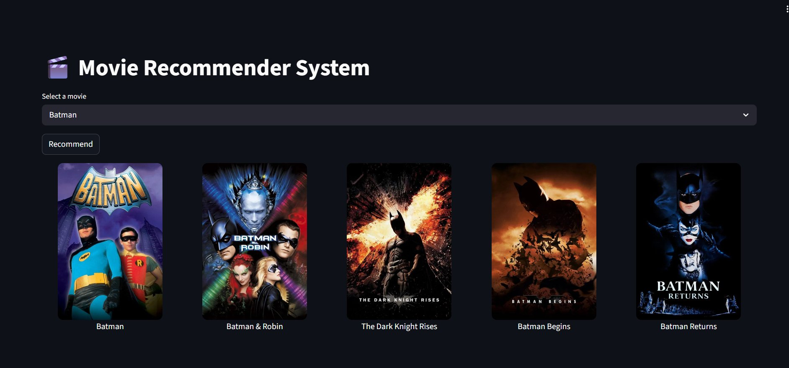
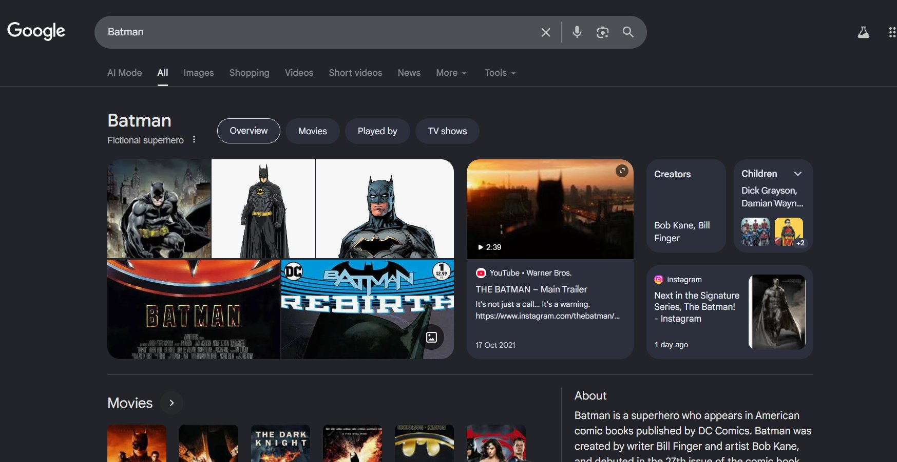

<div align="center">

# 🎬 Movie Recommender System

**A content-based movie recommendation system powered by Machine Learning and NLP**

[](https://python.org)
[](https://streamlit.io)
[](https://scikit-learn.org)

</div>

---

## 📸 Demo

> Select a movie from the dropdown and click **Recommend** to instantly discover 5 similar movies — complete with posters. Click any poster to search it on Google.

### 🎥 App Interface



*Searching for "Batman" returns similar DC superhero movies with full poster previews.*

### 🔗 Google Search Integration



*Clicking on any recommended movie poster redirects you directly to its Google search page for instant details.*

---

## 📌 Overview

The **Movie Recommender System** uses **content-based filtering** to suggest movies similar to the one a user selects. It analyzes movie metadata — including genres, cast, crew, keywords, and plot overview — and computes similarity scores using NLP and cosine similarity.

Clicking any recommended movie poster opens a **Google search** for that movie in a new tab, making it easy to learn more or find streaming options.

---

## ✨ Features

- 🎯 **Content-based recommendations** — suggests movies based on metadata similarity
- 🖼️ **Movie poster display** — fetches and renders posters for each recommendation
- 🔗 **Google search redirect** — click any poster to search for that movie on Google
- ⚡ **Fast results** — powered by precomputed cosine similarity matrices
- 🌙 **Clean dark UI** — built with Streamlit's native dark theme
- 📦 **Pickle-based caching** — no recomputation on every run

---

## 🛠️ Tech Stack

| Layer | Technology |
|-------|-----------|
| Language | Python 3.8+ |
| UI Framework | Streamlit |
| Data Processing | Pandas, NumPy |
| ML / NLP | Scikit-learn (CountVectorizer, Cosine Similarity) |
| API | TMDB API (movie posters & metadata) |
| Serialization | Pickle |

---

## 🧠 How It Works

```
User selects a movie
        ↓
Movie tags are retrieved (genres + cast + keywords + overview)
        ↓
CountVectorizer converts tags into feature vectors
        ↓
Cosine similarity computed between all movie pairs
        ↓
Top 5 most similar movies returned with posters
        ↓
Click any poster → opens Google search for that movie
```

1. **Preprocessing** — Raw movie data is cleaned and combined into a unified `tags` field per movie.
2. **Vectorization** — `CountVectorizer` converts text tags into bag-of-words feature vectors.
3. **Similarity** — Cosine similarity is computed between all movie vectors and stored as a matrix.
4. **Recommendation** — Given a query movie, the system retrieves the top 5 closest matches.
5. **Poster Fetch** — Posters are fetched via the TMDB API and displayed in the UI.
6. **Redirect** — Each poster links to a Google search for that movie title.

---

## 📂 Project Structure

```
movie_recommendation_system/
│
├── app.py                        # Streamlit web application
├── movie_recommendation.ipynb    # Jupyter notebook (EDA + model building)
│
├── models/
│   ├── movies.pkl                # Preprocessed movie dataframe
│   └── similarity.pkl            # Precomputed cosine similarity matrix
│
├── dataset/
│   ├── tmdb_5000_movies.csv      # TMDB movie metadata
│   └── tmdb_5000_credits.csv     # Cast & crew data
│
├── requirements.txt
└── README.md
```

---

## 🚀 Getting Started

### Prerequisites

- Python 3.8 or higher
- A free [TMDB API key](https://www.themoviedb.org/settings/api)

### 1. Clone the repository

```bash
git clone https://github.com/Nivadeka222/movie_recommendation_system.git
cd movie_recommendation_system
```

### 2. Install dependencies

```bash
pip install -r requirements.txt
```

### 3. Add your TMDB API key

In `app.py`, replace the placeholder with your API key:

```python
API_KEY = "your_tmdb_api_key_here"
```

### 4. Generate model files (first-time only)

Open and run `movie_recommendation.ipynb` in Jupyter to generate `movies.pkl` and `similarity.pkl`.

```bash
jupyter notebook movie_recommendation.ipynb
```

### 5. Launch the app

```bash
streamlit run app.py
```

The app will open at `http://localhost:8501`.

---

## 📊 Dataset

This project uses the **TMDB 5000 Movie Dataset** from [Kaggle](https://www.kaggle.com/datasets/tmdb/tmdb-movie-metadata):

| File | Description |
|------|-------------|
| `tmdb_5000_movies.csv` | Movie metadata — genres, keywords, budget, overview, etc. |
| `tmdb_5000_credits.csv` | Cast and crew information per movie |

---

## 📦 Requirements

```
streamlit
pandas
numpy
scikit-learn
requests
pickle-mixin
```

Install everything at once:

```bash
pip install -r requirements.txt
```

---

## 🤝 Contributing

Contributions are welcome! Here's how to get started:

1. Fork the repository
2. Create your feature branch: `git checkout -b feature/your-feature`
3. Commit your changes: `git commit -m "Add your feature"`
4. Push to the branch: `git push origin feature/your-feature`
5. Open a Pull Request


